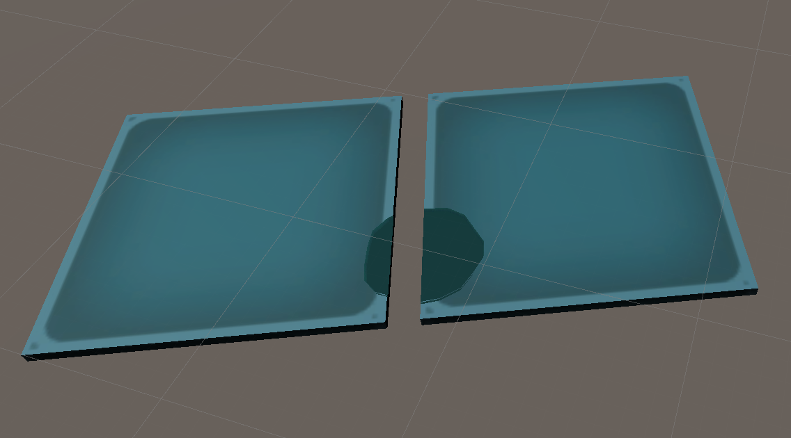
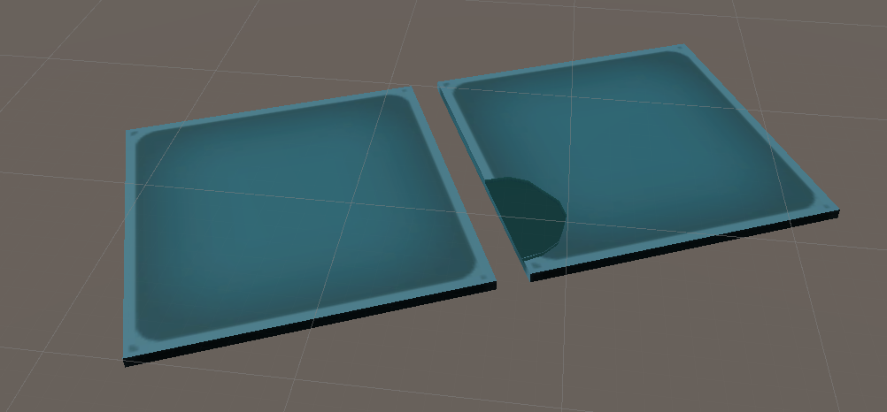

# unity_shader_csg
constructive sold geometry
## note
write mask:
        The GPU uses this value as a mask when it writes to the stencil buffer.Note that, like other masks, it specifies which bits are included in the operation. 
        For example, a value of 0 means that no bits are included in the write operation, 
         not that the stencil buffer receives a value of 0. 
## fixed issue
### render leak,such as below

### solution
allocate bush id to every bush, and select bush id when  circle is drawing,
note,bush id only odd number, because even number was prepared for shader calculate.

### final effect:

